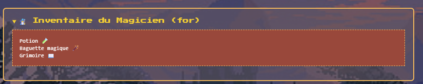
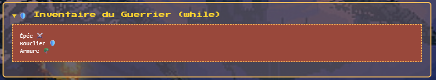

# Inventaire RPG

> [!note]
>
> **Quelques conseils utiles pour ce challenge**
>
> - Utilise autant de fois `console.log()` que nécessaire pour tester ton code
> - Regarde bien les exercices et la démonstration du formateur pour t'inspirer du code à créer
> - N'hésite pas à aller fouiller sur Internet pour t'aider

## Etape 1 - L'inventaire du magicien 🧙‍♂️

1. Déclare une fonction nommée `displayMagicianInventory()`
2. Déclare un tableau `items` avec trois accessoires : 'Potion 🧪', 'Baguette Magique 🪄' et 'Grimoire 📖'.
3. Crée une boucle `for()` qui prend 3 arguments :

   - Un index dont la valeur est `0`
   - Une condition qui indique que l'index doit toujours être inférieur à la taille du tableau (via `.length`)
   - L'incrémentation de l'indice se fera d'une unité

4. Affiche chaque élément de l'inventaire dans la console
5. Retourne le tableau `items` en fin de fonction

Résultat visuel attendu :

## Etape 2 - L'inventaire du guerrier ⚔️

1. Déclare une fonction nommée `displayWarriorInventory`
2. Déclare un tableau nommé `items` avec trois accessoires : `Épée ⚔️`, `Bouclier 🛡️` et `Armure 🪖`
3. Crée une variable nommée `count` dont la valeur est `0`
4. Crée une boucle `while()` dont la condition à déclarer entre les parenthèses doit être que le `count` a une valeur inférieure à la longueur du tableau `items`
5. Affiche dans la console chaque élément de l'inventaire du guerrier
6. Incrémente count de `+1` à chaque tour de boucle
7. En fin de fonction (après la boucle `while`), retourne le tableau `items`

## ⭐ BONUS ⭐ Étape 3 - Ton propre inventaire 🎒

Et si tu décidais de partir à l'aventure ? Qu'emporterais-tu ? Ce bonus va t'inviter à créer le code de base afin de renseigner tout cela.

On le rappelle, c'est un BONUS, si tu te sens fatigué, épuisé par la journée, prends un repos bien mérité. 🤗

1. Déclare une fonction `createInventory()`
2. Dans cette fonction, crée un tableau nommé `items` et qui ne contient rien
3. Crée une variable nommée `input` et récupère la saisie de l'utilisateur.
   > Indique dans le message du `prompt()` que si l'utilisateur saisit 'stop' alors son inventaire sera considéré comme fait.
4. Déclare une boucle `while()` dont la condition est que `input` doit être différent de `stop`
5. Dans cette boucle, ajoute la valeur d'`input` dans le tableau `items`
6. Redemande à l'utilisateur via `prompt()` ce qu'il souhaite ajouter à son inventaire (réutilise le même énoncé que tu as écrit la première fois dans `input` 😉)
7. En fin de fonction, après la boucle, retourne le tableau `items`

Si tu cliques désormais sur le bouton `Crée ton inventaire`, tu devrais pouvoir ajouter des éléments. 👍

